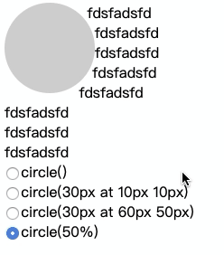
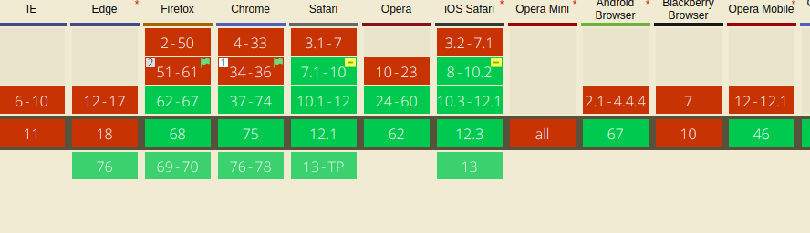
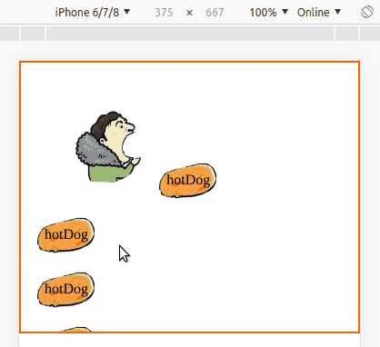

# css Shapes初探
> 题记

css体内蕴藏在巨大的能量，前段时间听说有人用css完成和黑客窃取信息的操作，在下听了真是要给他跪了，虽然我们不提倡这种行为，但是这提醒我是时候重新认识css了。 

> 简介

shapes算是一类css3的属性，那么性质如下：
|名称|解释|
|-------|-----|
|shape-image-threshold|CSS属性定义使用alpha通道阈值提取形状shape-outside使用一个图像作为值。|
|shape-outside|CSS属性定义的是非矩形的形状，相邻的内联内容应该围绕该形状进行包装。默认情况下，内联内容包围其边框|
|shape-margin|该shape-margin CSS属性为shape-outside添加外边距。|
* tips:以上信息为MDN翻译得来，（我想说什么跟什么呀，难以理解）

下面我会把我通过使用的理解跟大家分享一下。

### shape-outside
先给大家介绍一下```shape-outside```的用法吧，汉语直译就是```外部形状```，其实差不多就是这个意思。
在MDN上列举了shape-outside的属性值，我们不妨边看边说：

shape-outside有以下五个关键字值
`none`属性值最好理解，啥事儿都没法生，行内元素以默认的方式包裹该元素。
`margin-box`则是指出该浮动元素被定义成以外边距的外围包裹的封闭空间。换句话说就是浮动元素的形状计算区域按外边距的外边缘为准。
`border-box`定义了以边框为边界形成的封闭图形。
`padding-box`定义了以内边距的外边缘形成的封闭图形。
`content-box`定义了有内容区域也就是padding包裹的区域形成的封闭空间。
我们可以类比box-sizing中的属性值去理解联想记忆这几个属性值的区别。
>/* 关键字值 */
shape-outside: none;
shape-outside: margin-box;
shape-outside: content-box;
shape-outside: border-box;
shape-outside: padding-box;

>/* 函数值 */
shape-outside: circle();
shape-outside: ellipse();
shape-outside: inset(10px 10px 10px 10px);
shape-outside: polygon(10px 10px, 20px 20px, 30px 30px);

除了以上的值类型属性值外还有函数类型的属性值，函数类型的属性值较为常用。
`circle()`就是定义了一个圆形的区域,在括号内可以传入参数，标准的定义是这样的：`<circle()> = circle([ <shape-radius> ]? [ at <position>]? )`,乍一看很难懂，实际这是一种十分严谨、清晰的表达方式，这里是通过弧形半径和位置两个方面设置，具体的效果如下图。


ellipse()则是定义一个椭圆区域，参数配置的方法与circle()大体相同，但也有差别，比如椭圆需要设置长半径和短半径，这里就不演示了，给出标准定义：
`<ellipse()> = ellipse( [<shape-radius>{2}]?[ at <position>]? )`，感兴趣的小伙伴自己试一试。

polygen()定义多边形,原理比较简单
`<polygon()> = polygon( <fill-rule>? , [<length-percentage><length-percentage>]# )`


>/* <url> 值 */
shape-outside: url(image.png);

>/* 渐变值 */
shape-outside: linear-gradient(45deg, rgba(255, 255, 255, 0) 150px, red 150px);

>/* 全局值 */
shape-outside: initial;
shape-outside: inherit;
shape-outside: unset;

> 并不美好的兼容性

给大家泼个冷水，`shape-outside`的兼容性并不好，我们在caniuse上看一下：



> 演示在最后
这里我写了一个很有趣的demo，是利用shape-outside的ellipse()函数属性进行定义的。


