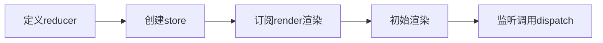

# Redux学习笔记

### 题记

* 作为一个前端小白，今天来学习一下redux，顺便整理笔记一是为了复习，二来也希望能给各位小伙伴一点提示和经验。
* 最开始我以为redux是一个react的子组件，只能结合react使用，后来发现我错了，用redux官方自己的解释说就是: ***Redux 是 JavaScript 状态容器，提供可预测化的状态管理。***
* 那么既然是JavaScript用的，我决定用最纯粹的手法学习redux，也就是不是用结合react，这好处在那里呢，其实最大的好处就是我react用的也不熟==||。

### 经典的counter案例

我们本着纯粹的思想，在html里引入两个script分别是babelpolyfill(可选)，redux（必选  “废话==||”）,也可以使用本地文件。
>
```
<script src="https://cdn.bootcss.com/babel-polyfill/7.0.0-rc.4/polyfill.min.js"></script>
```

>   
``` 
<script src="https://cdn.bootcss.com/redux/4.0.1/redux.min.js"></script>
```
这是一个累加器，这个案例的基本实现思想就是将数字放入一个容器，叫**state**，触发累加操作时不是粗暴地直接改变state的值，而是只能通过**触发action**的方式改变state，具体的步骤就是：

```javascript
/**
    * 
    * todo 鼠标点击数字增加
    * * createStore 
    * * store.subscribe
    * * store.dispatch
    * * store.getState
    * 
*/

const { createStore } = Redux;
const counter = ( state = 0, action ) => {
    switch(action.type){
        case 'INCREMENT':
            return state + 1;
        case 'DECREMENT':
            return state - 1;
        default:
            return state;
    }
}
const store = createStore(counter);
const render = () => {
    document.body.innerText = store.getState();
}
store.subscribe(render);
render();

document.addEventListener('click', () => {
    store.dispatch({ type: "INCREMENT" })
})
```
让我来慢慢解释上面的代码：
------------------------
* [*createStore*](https://www.redux.org.cn/docs/api/createStore.html)是一个创建器，用来创建app中唯一的store用的，官方的解释是这样的：createStore是用于创建保存应用完整状态树的store的工具。在一个app中只能存在 ***唯一*** 的store。
具体的内容大家可以点击链接到官网查看，这里的话只要将counter方法以参数传入即可，它就会返回想要的store。

等等！！！“想要的store”是啥东西？，好吧，瞒不过你们，介绍一下store吧。
* [*store*](https://www.redux.org.cn/docs/basics/Store.html)就是一个“仓库”，里面“存着”应用的状态，对于状态的一些方法，而我们往往只能通过这些方法访问和操作状态数据state，你可以理解为去仓库取东西不应该自己去拿，而是告诉仓库管理员你想干啥，由他来操作。
再次重申一下 **store对于一个Redux应用，只有一个！！**
具体的方法请接着往下看

* [*getState*](https://www.redux.org.cn/docs/api/Store.html#getState)顾名思义，就是获取state的方法,不多说了,不清楚可以运行一下上面的代码就明白了。


